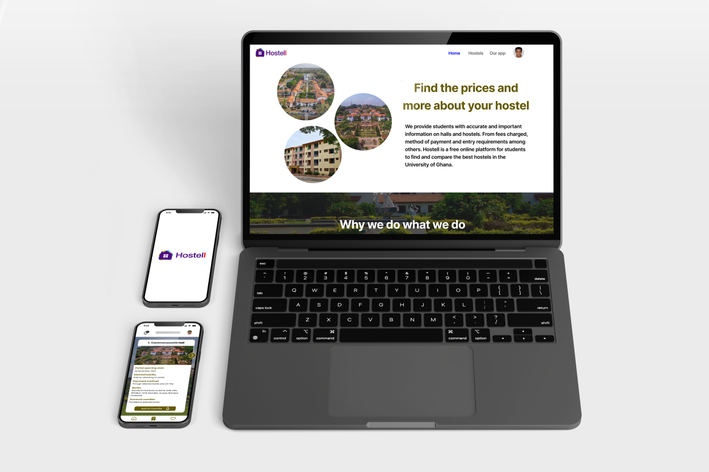

 

# 💫 About Me:
I'm a UI/UX designer looking to get into frontend development for mobile and web🔥. I'm currently learning Flutter/ Dart and React for mobile development and HTML, CSS and Javascript for web development🎉. My passion is building amazing 3D interactive web and mobile applications which are still user-intuitive✨.

 
 

## 💾 Tech Stack:

  

## 💻 Apps Utilized:

  

## 🌐 Socials:
 
 
 
 

 
 
 

# 📊 GitHub Stats:
 
 

## 🏆 GitHub Trophies

### ✍️ Random Dev Quote

### 🔝 Top Contributed Repo

---

<!-- Proudly created with GPRM ( https://gprm.itsvg.in ) -->
